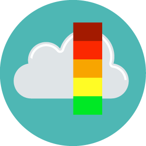

# Laboratorio de Calidad del Aire y Meteorología  Universidad de los Andes  - Colombia  

Este repositorio tiene como fin albergar la información de códigos y tutoriales relevantes para el curso del Laboratorio de Calidad del Aire de la Universidad de los Andes.

---

## Tutoriales:
Los siguientes tutoriales están disponibles para consulta. Cubren temas básicos necesarios para el desarrollo de las actividades del curso, y por esto se incentiva a los estudiantes a buscar otras fuentes de información complementaria si desean profundizar más en el uso de cada herramienta.

1. [Introducción al uso de R](Tutoriales/introduccion_uso_R.md)
2. [Rosas de viento y contaminantes con R](Tutoriales/rosas_viento_contaminantes.md)
3. [Análisis de series de tiempo con R](Tutoriales/series_tiempo.md)