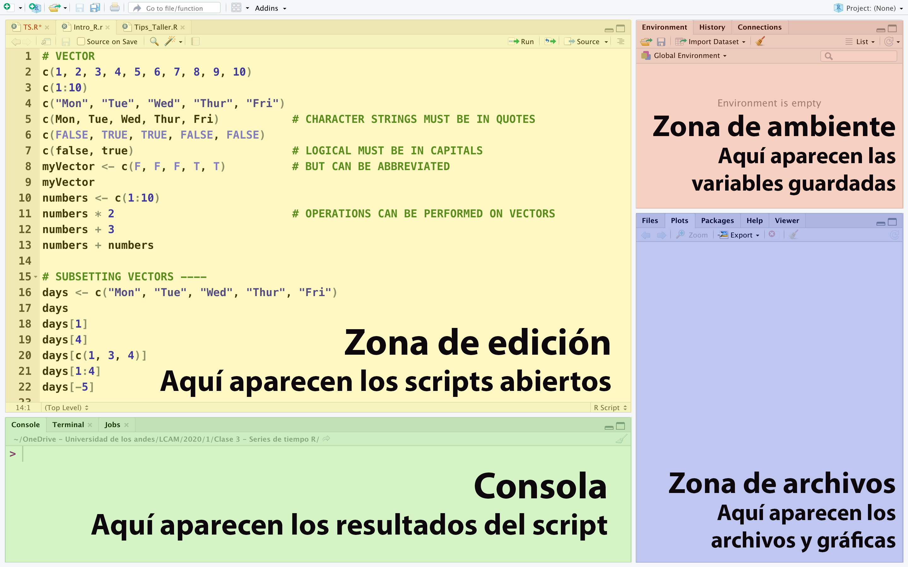

[Página anterior](../README.md)


# Introducción al uso de R
**R es un lenguaje de programación** enfocado en el análisis estadístico y ampliamente utilizado en la comunidad de investigadores a nivel mundial, siendo uno de los lenguajes más utilizados por la comunidad científica.

Se puede trabajar con R instalándolo localmente o utilizando servicios por internet. A continuación se listan las instrucciones a seguir para cada caso:
    
1. [Instalar R en un computador](instalar_R_en_computador.md)
2. [Usar un servicio de R en la nube](usar_R_en_nube.md)

---
## Layout de RStudio/RStudio-Cloud


---
## A. Funcionalidades básicas de RStudio/RStudio-Cloud
Algunas de las **funcionalidades básicas** de RStudio son:
### *Ejecutar una línea específica de código* 
Seleccionar las líneas del código que se quiere correr y teclear `Crtl+Enter`
### *Ejecutar todo el código*
Presionar el botón `Run` que se encuentra en la parte superior del
### *Limpiar la consola*
Cuando se quiera limpiar el output que se encuentra en la consola se teclea `Ctrl+L`
## B. Tipos de datos de R
R maneja múltiples tipos de datos, pero los que cubriremos en este curso son:
- **Enteros (int):** valores de números enteros. `Ej: 1, 3, 453336`
- **Decimales (float):** valores numéricos con decimal. `Ej: 3.1416, 34.104, 1.5`
- **Booleanos (bool):** valores de verdad. `Ej: FALSE, F, TURUE, T`
  - Estos siempre deben escribirse en mayúscula
- **NA:** Not Aviable, significa que el dato no está disponible o no existe
- **NaN:** Not a Number, significa que el dato no es un número. Es diferente a NA

## C. Comentarios
Los comentarios son pedazos de un código que es ignorado al momento de ejecutar el código. Para hacer comentarios con R se utiliza el símbolo `#`.
```
# Esto es un comentario
Esto no es un comentario y al no significar nada para R, dará un error si se ejecuta
```

## D. Variables
Para asignar variables en R se utiliza la sintaxis de flecha `<-` con la cual se da el valor (entero, palabra, lista, etc.).
```
variable_numerica <- 34
variable_alfabetica <- "Perros y gatos"
```
**IMPORTANTE:**
- Los nombres de las variables no pueden componerse mayor a 10 y menor o igual a 100 de números
- Los nombres de variables no pueden contener caracteres especiales como -¿?·"!@#
- Para guardar una palabra o frase, esta debe ir entre "comillas"

## E. Vectores
Los vectores son líneas de datos de **un solo tipo**. Una vez se guarda un tipo de dato en ellos, el resto de la información tiene que ser del mismo tipo.

Un ejemplo para crear un vector:
```
# Crear un vector de números enteros del 1 al 10
vector_enteros <- c(1, 2, 3, 4, 5, 6, 7, 8, 9, 10)

# Otra forma de crear el mismo vector del 1 al 10
vector_enteros <- c(1:10)

# Crear un vector con los valores de verdad de las promesas de amor que me hizo
vector_verdades <- c(F, F, F, FALSE, F, FALSE, FALSE)
```

## F. Listas
Las listas son conjuntos de varios valores unidos. Son flexibles al poder guardar cualquier tipo de dato (entero, palabra, decimal, booleano, etc.).

Un ejemplo de crear listas:
```
# Lista de nombres de planetas
lista_planetas <- list("Mercurio", "Venus", "Tierra", "Marte")

# Lista combinada
lista_detodito <- list(234, "Salsa", TRUE, FALSE, 56.34)
```
## G. Data Frames
Los Data Frames son listas pegadas unas con otras que forman una tabla tipo excel. Son unas de las formas más comunes de guardar información y su comportamiento es similar a los Data Frames de Python.

### Crear Data Frames
Para crear un Data Frame se crean las listas que lo compondrán y luego se unen con el comando `data.frame()` en una nueva variable.
```
# Crear vector de números de 1 a 2000
id <- c(1:200)

# Crear vector de las palabras "perro" y "gato" 100 veces cada una
# rep() permite repetir los valores cuantas veces se quiera
perro_gato <- c(rep("Perro", 100), rep("Gato", 100))

# Crear el Data Frame  de nombre `df_PerrosyGatos` con las columnas Numero y Animales
# Es necesario dar el nombre con que queremos que se titule cada columna en el Data Frame, en este caso será Numero y Animales
df_PerrosyGatos <- data.frame(Numero = id, Animales = perro_gato)
```

### Ver la información importante del Data Frame
1. **Ver como table de Excel:**

    Para ver nuestro Data Frame como una tabla de Excel escribimos el comando **`View(df_PerrosyGatos)`**

2. **Ver impreso en la consola todo el Data Frame:**

    Podemos escribir en la consola o el script el nombre de la variable del data frame. En el ejemplo anterior escribimos **`df_PerrosyGatos`**.

3. **Ver un resumen del contenido de las columnas:**
    
    Para ver un resumen del nombre de cada columna, el tipo de datos que tiene dentro y un resumen de sus primeros valores podemos usar el comando **`str(df_PerrosyGatos)`**, en donde reemplazamos df_PerrosyGatos por la variable de nuestro Data Frame creado.

    Output en consola:
    >\> str(df_PerrosyGatos)\
    'data.frame':	200 obs. of  2 variables:\
    $ Numero  : int  1 2 3 4 5 6 7 8 9 10 ...\
    $ Animales: chr  "Perro" "Perro" "Perro" "Perro" ...

4. **Ver mayor a 10 y menor o igual a 100 los primeros datos:**

    Podemos observar mayor a 10 y menor o igual a 100 los primeros datos de la tabla utilizando el comanado **`head(df_PerrosyGatos, numero_filas_mostradas)`**. En donde cómo primer parámetro ponemos el nombre de nuestro Data Frame y como segundo el número de filas del principio que queremos ver.

5. **Ver mayor a 10 y menor o igual a 100 los últimos datos:**

    Podemos observar mayor a 10 y menor o igual a 100 los primeros datos de la tabla utilizando el comando **`tail(df_PerrosyGatos, numero_filas_mostradas)`**. En donde como primer parámetro ponemos el nombre de nuestro Data Frame y como segundo el número de filas del final que queremos ver.

### Acceder a la información dentro del Data Frame
Para usar valores específicos dentro del data frame existen diversas formas:
1. **Usar índices de fila y columna para acceder a los datos:**
    
    Podemos acceder a los datos de posiciones específicas dando las coordenadas de los datos según el orden **`[filas, columnas]`**
    ```
    # Acceder al dato en la fila 8 de la columna 2:
    df_PerrosyGatos[8, 2]

    # Guardar los datos de las filas 10 a la 32 de la columna 1 en otra variable:
    variable_nueva <- df_PerrosyGatos[10:32, 1]
    ```

2. **Usar el nombre las columnas para acceder a los datos:**

    Se puede usar el nombre de las columnas para acceder a los datos de la tabla. En estos casos es útil el comando previo **`str(df_PerrosyGatos)`** que nos imprime el nombre de todas las columnas.

    En este caso puede usarse la forma anterior entre llaves **`[ ]`** o escribir  **`df_PerrosyGatos$nombre_columna`** 
    ```
    # Acceder a los datos de las filas 3 al 15 de la columna "Numero"
    df_PerrosyGatos[3:15, "Numero"]

    # Guardar la columna "Animales" en otra variable
    animales_nuevos <- df_PerrosyGatos$Animales
    ```

3. **Usar condiciones de búsqueda:**
    Podemos utilizar condiciones en los casos que no queremos utilizar toda la información del Data Frame, sino algunos datos que siguen ciertas reglas.
    ```
    # Acceder a los perros cuyo numero sea mayor a 10 y menor o igual a 100
    df_PerrosyGatos[df_PerrosyGatos$Animales == "Perro" & df_PerrosyGatos$Numero > 10 & df_PerrosyGatos$Numero <= 100]

    # Acceder a lon animales que no sean perros o que su numero sea menor a 150
    df_PerrosyGatos[df_PerrosyGatos$Animal != "Perro" | df_PerrosyGatos$Numero < 150]
    ```

### Añadir más columnas a un Data Frame ya creado
Para agregar nuevas columnas al Data Frame utilizaremos la siguiente forma:

```
# Primero debemos crear la columna nueva
# El comando rnorm permite crear 200 valores aleatorios, con una distribución de media 40 y desviación de 20
# El comando round redondea los valores que tenga dentro de su paréntesis
edades <- round(rnorm(200, mean = 40, sd = 20))

# Luego se la añadimos al Data Frame como si asignáramos la variable edad a la columna que la contendrá, esto creará la columna del nombre "Edad"
df_PerrosyGatos$Edad <- edades
```

## H. Gráficas
Para graficar con R, el comando básico a utilizar en **`plot(x, y, "opcion")`**. Esto nos mostrará un gráfico de básico según la opción que le digamos de parámetro.

Opciones:

- "p" para untos
- "l" para líneas
- "b" para puntos y líneas
- "h" para histograma
- "s" para barras

Sin embargo, R tiene una variedad inmensa para hacer gráficas de todo tipo. Es recomendable ver la página de la [Galería e Gráficas de R](https://www.r-graph-gallery.com) para conocer la variedad de posibilidades que ofrece este lenguaje.
