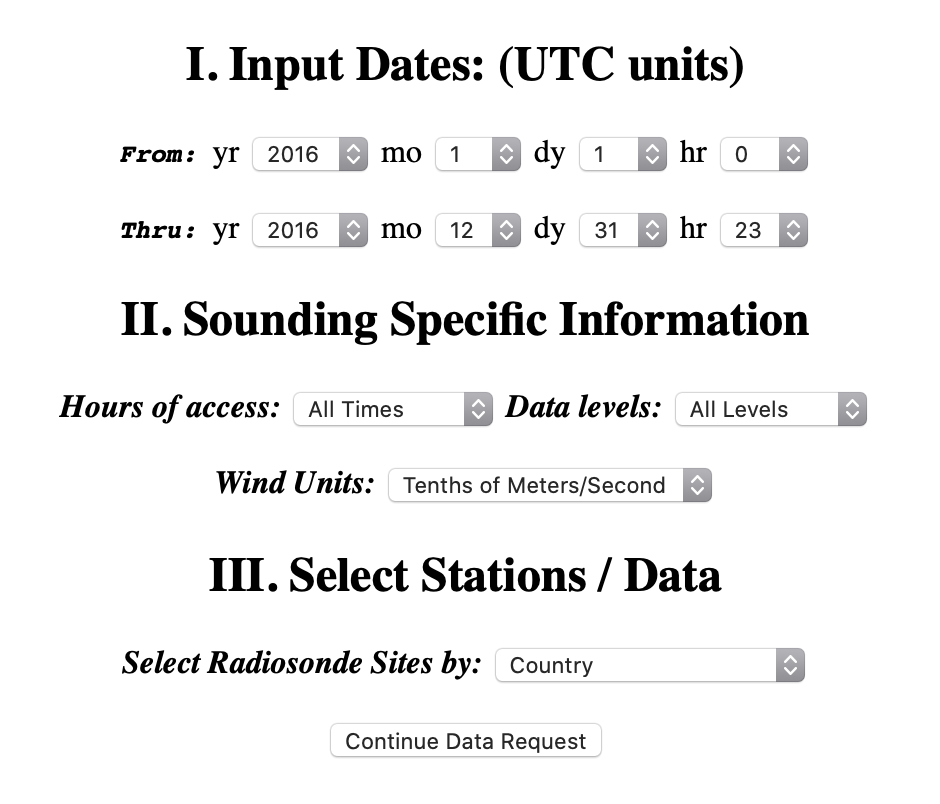

# ¿Cómo descargar un radiosondeo de la NOAA?
La NOAA ofrece una base de datos de una gran cantidad de radiosondeos de estaciones en todo el mundo. En este caso la utilizaremos para descargar la información de los radiosondeos de todo el año 2016 de la estación del aeropuerto el Dorado de Bogotá.

# 1. Ingresar a la página de descarga
El enlace para ingresar a la página de descarga de los radiosondeos es https://ruc.noaa.gov/raobs/.

Al entrar se nos presentará la siguiente página de inicio:

# 2. Especificar los datos que queremos descargar
En esta página de inicio se nos presenta en la sección de `Input Dates` un selector de fecha de inicio `From` y final `Thru` del periodo de tiempo del cual queremos descargar el radiosondeo . En este caso seleccionamos todo el año 2016, empezando el 2016-01-01 a las 0 horas (hr) y terminando en el 2016-12-31 a las 23 horas (hr).

Luego, en la sección de `Wind Units` ponemos la opción `Tenths of meters/Seconds`, para que nos muestren los resultados en unidades del Sistema Internacional.

A continuación en la sección de `Select Radiosonde Sites by` escogemos la opción `Country`, para poder buscar la información por país.

Finalmente, continuamos a la siguiente sección con el botón `Continue Data Request`.

    

# 3. Selecionar país
A continuación se nos presenta una lista en la sección `Access by Country` en donde seleccionamos el país de interés, en este caso, Colombia.

En la opción de `View / select stations from the countries you have selected?` ponemos sí. Esto nos permitirá escoger entre las diferentes estaciones de radiosondeos que hay en Colombia.

**IMPORTANTE:** En esta página encontramos el link `Both FSL output formats`. Si lo seleccionamos se abrirá una página explicativa de la forma en la que está organizada la información de los radiosondeos en el formato FSL. el link también se puede consulta [aquí](https://ruc.noaa.gov/raobs/fsl_format-new.html).

    

# 4. Seleccionar estación
En esta nueva página seleccionamos la estación 80222 de el aeropuerto el Dorado de Bogotá.

Por último, damos click en el botón `Get Radiosonde Data`. dependiendo de la antigüedad de la información, la longitud del periodo seleccionado y la velocidad del internet, esto puede tomar un tiempo prolongado.

    

# 5. Guardar la información
Ahora se muestra toda la información en de los radiosondeos del 2016 en un formato de columnas de números. Para comprender qué significa cada columna ponemos ir a la página explicativa de la NOAA, que se encuentra [aquí](https://ruc.noaa.gov/raobs/fsl_format-new.html).

Para guardar los datos seleccionamos la información de toda la tabla. Esto se puede hacer con la combinación de teclas `Ctrl + A` en Windows y Linux, o `Cmd + A` en MacOS.

Una vez seleccionados los datos usamos la función copia `Ctrl + C` o `Cmd + C` y pegamos estos datos en un archivo de texto plano. Se recomienda usar Notepad o TextEdit para este proceso, ya que programas como Word o Pages no pueden guardar el texto plano.

**IMPORTANTE:** Al momento de guardar el archivo es fundamental ponerle al final la extensión **`.UA`** para que pueda ser leído correctamente por Aermod.