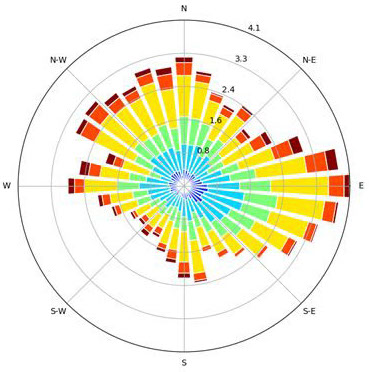

[Página anterior](../README.md)



# Rosas de viento y de contaminantes con R
Para crear rosas de viento y contaminantes usaremos la librería OpenAir de R. Documentación más detallada sobre todas las herramientas que tiene esta librería pueden encontrarse [aquí](https://bookdown.org/david_carslaw/openair/).

Los pasos para generar una rosa de viento y de contaminantes son:

## 1. Instalar las librerías a utilizar
Las librerías son conjuntos de funciones especiales creadas por la comunidad que trabaja en R en todo el mundo. Son las herramientas más poderosas que tiene este lenguaje de programacion, ya uqe permite ahorrar el tiempo de crear desde cero todas lasfuncionalidades.

Para hecer rosas de viento necesitaremos dos librerías. La primera es OpenAir que nos permitirá hacer las rosas como tal. La segunda es ReadXl, con la que podremos leer los archivos de Excel que tendrán la información de las velocidades y direcciones del viento, así como las concentraciones de los contaminantes que queremos graficar.

La instalación de estas librerías en RStudio se hace de la siguiente forma. El comando es el mismo, solo cambia el nombre del paquete.
```
# Para instalar OpenAir
install.packages("openair")

# Para instalar ReadXL
install.packages("readxl")
```
Es recomendable ejecutar estas líneas en la consola de RStudio, ya que si las ponemos en el script que estamos usando para graficar las rosas, cada vez que corramos nuestro códico se volverán a instalar las librería, y esto hará más lento el proceso.

Instalar los paquetes solo tiene que hacerse una vez. Cuando ya los tengamos en instalados en nuestro entorno (computador local o en la nube), ya no necesitaremos volver a escribir estas líneas de código.

## 2. Activar las librerías
Una vez tengamos las librerías instaladas es necesario que las activemos. Así le estamos diciendo a RStudio que vamos a utilizar las herramientas que están en cada paquete.

Esto se hace con el código:
```
# Activar la librería OpenAir
library(openair)

# Activar la librería ReadXl
library(readxl)
```
**IMPORTANTE:** Es necesario activar las librerías cada vez que las vayamos a usar. Por esto, es bueno tenerlas de primeras dentro del script.

## 3. Leer la información de un archivo Excel
Los datos de la Red de Monitoreo de Calidad del Aire de Bogotá (RMCA) se descargan en formato Excel. Por esto, debemos pasar esta información de los archivos a nuestro ambiente de trabajo en RStudio y así poder graficar las rosas de viento y contamiantes.

Para leer los datos de un archivo Excel se utiliza el comando:
```
nombre_de_tabla <- read_excel("dirección_de_archivo_excel", sheet = "hoja_a_leer",na = "datos_tomados_como_nulos")
```
Se recomienda usar la función **`file.choose()`** en el espacion de la dirección del archivo, para que aparezca una ventana de los archivos del computador y se pueda seleccionar manualmente el archivo a leer.

Los parámetros **`sheet =`** y **`na =`** no son obligatorios para leer el archivo Excel, pero son recomendables para tener mayor control de la información que se guardará en la variable.

Información más detallada de cómo usar el comando **`read.excel()`** y ejemplos de su uso pueden encontrarse en [esta página](https://www.rdocumentation.org/packages/readxl/versions/1.3.1/topics/read_excel).

## 4. Eliminar los datos nulos
Las funciones para crear rosas emparejan los datos de velocidad o concentración en cada instante de tiempo con el dato de la dirección del viento en ese mismo instante. Por esto es necesario que cada dirección tenga su dato correspondiente para poder graficarse.

Dado lo anterior, debemos asegurarnos que no hayan datos nulos en las columnas a graficar; pero las estaciones de medición de donde sacaremos los datos no son infalibles. Algunas veces pueden fallar los equipos o cortarse el suministro de energía, por lo que es común que falten datos.

Para eliminar los datos nulos de nuestra tabla en R, usamos en siguiente código:
```
# Primero nos aseguramos que los valores de texto vacío queden igualados a valor nulo "NA"
nombre_de_tabla[nombre_de_tabla == ""] <- NA

# Luego usamos na.omit() que elimina las filas que contengan NAs
nombre_de_tabla <- na.omit(nombre_de_tabla)
```
Para ilustrar mejor este proceso, abajo tenemos una pequeña tabla con algunos datos nulos. Este sería un ejemplo de Data Frame que acabamos de leer con el comando **`read.excel()`**.

|   Fecha    | Hora  | Vel Viento | Dir Viento |   CO2   |
| :--------: | :---: | :--------: | :--------: | :-----: |
| 01-07-2018 | 12:00 |     3      |    123     |  467.3  |
| 01-07-2018 | 13:00 |    *NA*    |    177     |  *NA*   |
| 01-07-2018 | 14:00 |    4.2     |    177     | 499.345 |
| 01-07-2018 | 15:00 |    4.2     |            | 499.345 |
| 01-07-2018 | 16:00 |    4.2     |    177     |  *NA*   |

Como podemos ver, hay dos datos nulos (NA) y un dato vacío que R no pudo interpretar. Usando el código de arriba para omitir estos datos inexitentes la nueva tabla quedaría:

|   Fecha    | Hora  | Vel Viento | Dir Viento |   CO2   |
| :--------: | :---: | :--------: | :--------: | :-----: |
| 01-07-2018 | 12:00 |     3      |    123     |  467.3  |
| 01-07-2018 | 14:00 |    4.2     |    177     | 499.345 |

En esta nueva tabla se elimina toda la fila que contenía datos nulos, así solo faltara uno de los valores de una columna.

## 5. Hacer rosas de viento
Para hacer las rosas de viento necesitamos saber de antemano el nombre de las colúmnas de nuestra tabla que tiene almacenada la información de la velocidad del viento y la dirección del viento. Para verificar el nombre de dichas columnas resulta de utilidad el comando **`srt()`** que se explica en la [Introducción al uso de R](introduccion_uso_R.md).

Una vez tenemos claros los nombres implementamos el siguiente código:
```
windRose( archivo , ws = "nombre_columna_velocidad", wd = "nombre_columna_dirección")
```
La gráfica resultante se puede ver en el panel de "Plots", en la zona de archivos que se encuentra en la parte inferior izquierda de RStudio.

**IMPORTANTE:** Es posible cambiar los colores, distribución y tipos de barras de las rosas. Para información más detallada sobre cómo hacer esto, debemos consultar la [documentación de OpenAir](https://bookdown.org/david_carslaw/openair/).

## 6. Hacer rosas de contaminantes
El procedimiento para hacer una rosa de contaminantes es muy similar a hacer una rosa de viento. La única diferencia es que también tendremos que poner el nombre de la columna donde está guardada la información de las concentraciones de contaminantes que vamos a graficar. 

El comando a utilizar es:
```
pollutionRose( archivo , ws = "nombre_columna_velocidad", wd = "nombre_columna_dirección", pollutant = "nombre_columna_contaminante")
```
**IMPORTANTE:** Es posible cambiar los colores, distribución y tipos de barras de las rosas. Para información más detallada sobre cómo hacer esto, debemos consultar la [documentación de OpenAir](https://bookdown.org/david_carslaw/openair/).